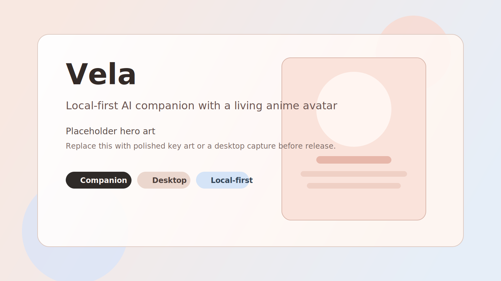
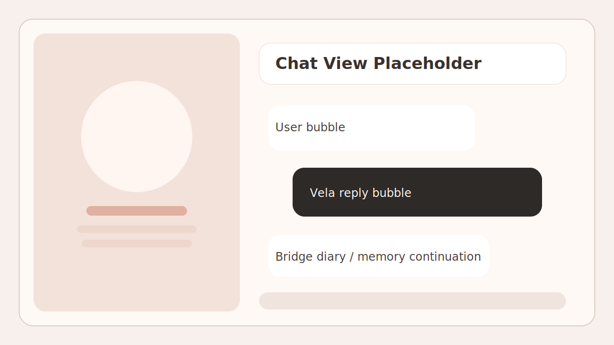
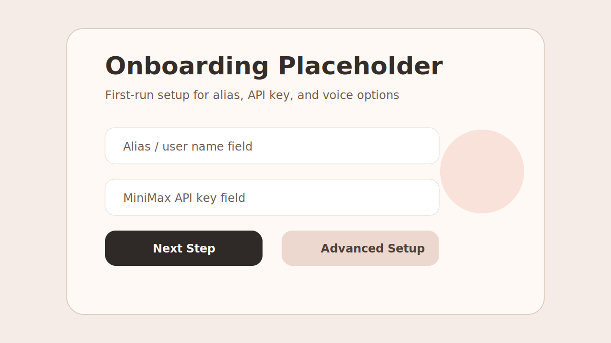
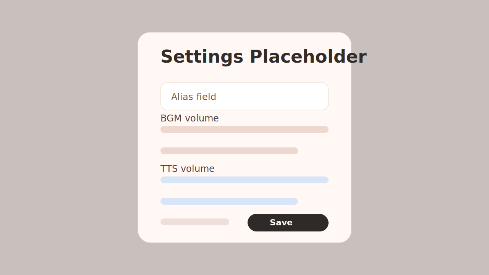

# Vela

> A local-first AI companion with a living anime avatar, continuous memory, and a relationship that grows with you.

🌏 [中文文档](README.zh-CN.md)




Source release status: Vela runs from source today with `git clone -> npm install -> npm start`. Packaged installer work is the current M6 milestone.

## What Is Vela?

Vela is not a chatbot with a wallpaper behind it. She is a desktop companion.

She has a real 3D body, a voice, emotional presentation, memory across sessions, and a relationship arc that changes how she talks to you over time. She starts reserved, warms up naturally, and only gets closer when your conversations actually earn it. Not instant fake intimacy. Not enterprise copilot energy. 她不是工具, 她是陪伴.

Under the hood, Vela is a local-first Electron app built with React, Three.js, and VRM. Conversations, summaries, user facts, and relationship state are stored on your machine. You can tune her personality, swap the avatar model, and customize the emotion and voice stack.

## Why Vela?

Most anime companion apps are cloud-only, privacy-invasive, and visually dead. Vela goes in the opposite direction.

- She has real visual presence: a live VRM avatar with emotion, posture, camera framing, and lip sync.
- She remembers you across sessions: recent summaries, user facts, relationship state, and ongoing conversation bridges are stored locally.
- She does not start at maximum closeness: the relationship system moves from `reserved -> warm -> close`.
- She feels authored instead of generic: the interaction policy keeps her restrained, emotionally coherent, and more character-like than assistant-like.
- She is open source: if you want a different voice, a different avatar, or a different temperament, you can change it.

## Feature Highlights

- 🧠 Continuous local memory with summaries, facts, bridge notes, and relationship state saved to disk.
- 💗 Relationship arc that advances from `reserved` to `warm` to `close` based on actual interaction history.
- 🎭 Twelve emotion presets that coordinate facial expressions, body language, camera framing, and TTS behavior together.
- 🗣️ Streaming MiniMax WebSocket TTS with emotion-aware voice presets and segment-by-segment playback.
- 👄 Real-time lip sync driven by visemes through HeadAudio, with amplitude fallback when needed.
- 🧍 VRM avatar rendering with Three.js and retargeted Mixamo motion clips for idle and emotion-driven presence.
- 🌦️ Time-aware and weather-aware proactive openings that can gently check in instead of waiting silently forever.
- 📝 Startup memory peek and bridge diary notes so unfinished conversations are easy to pick back up.
- ⚙️ First-run onboarding, settings, model switching, voice mode toggles, and fullscreen desktop presentation.
- 🔒 Local-first boundaries: Vela is a companion shell, not a system-control agent.

## Quick Start

1. Clone the repo.

```bash
git clone <your-repo-url>
cd Vela
```

2. Install dependencies.

```bash
npm install
```

3. Open [`vela.jsonc`](vela.jsonc) and set the machine-specific values you want to use locally.

```jsonc
{
  "runtime": {
    "storageRoot": "./.vela-data"
  },
  "llm": {
    "provider": "minimax-messages",
    "apiKey": "YOUR_LLM_API_KEY"
  },
  "tts": {
    "enabled": true,
    "provider": "minimax-websocket",
    "apiKey": "YOUR_TTS_API_KEY"
  },
  "avatar": {
    "assetPath": "C:/path/to/your-avatar.vrm"
  }
}
```

4. Start Vela.

```bash
npm start
```

Optional for renderer + Electron dev workflow:

```bash
npm run dev
```

Notes:

- The current repo is a source release, not a packaged installer yet.
- Update any machine-specific paths in [`vela.jsonc`](vela.jsonc) before first run.
- Prefer `apiKeyEnv` over hardcoded keys if you plan to publish your own fork.
- If you want mic input, use `asr.provider: "webspeech"` in [`vela.jsonc`](vela.jsonc).

## Screenshots







## Architecture Overview

Vela is split into an Electron main process, a React renderer, and a local core runtime that handles memory, relationship state, emotion planning, provider routing, and speech orchestration.

```text
electron/main.js
  -> boots Electron window + IPC bridge
  -> owns VelaCore

src/core/vela-core.js
  -> loads config and local state
  -> retrieves memory + awareness context
  -> calls the LLM provider layer
  -> resolves emotion / camera / action / TTS plan
  -> streams speech events back to the renderer

src/App.jsx
  -> chat shell, onboarding, settings, voice mode
  -> AudioPlayerService for streamed playback + replay
  -> VrmAvatarStage for the 3D scene

src/core/vrm-avatar-controller.js
  -> VRM loading, Mixamo retargeting, morphs, pose, camera
```

More detail lives in [`docs/ARCHITECTURE.md`](docs/ARCHITECTURE.md).

## Configuration

[`vela.jsonc`](vela.jsonc) is the main runtime config. The most important fields for a fresh clone are:

- `runtime.storageRoot`: where local memory and session state are stored
- `llm.*`: model provider, base URL, API key, fallback route
- `tts.*`: voice provider, model, voice ID, and audio settings
- `asr.*`: optional mic input provider
- `avatar.assetPath`: the local VRM model path
- `audio.*`: BGM and TTS volume defaults

If you are preparing a public fork, scrub local paths and secrets before you push. Vela supports `apiKeyEnv` for both LLM and TTS configuration, so you do not need to commit real keys.

## Roadmap

Current focus: **M6 productization / packaging**.

- Release-safe storage defaults instead of developer-machine paths
- Bundled avatar and startup asset strategy
- Packaging and installer workflow for desktop distribution
- Better first-run setup for non-dev users

Already in the repo today:

- Continuous memory and summaries
- Relationship progression
- Emotion-driven avatar presentation
- Streaming voice and lip sync
- Onboarding, settings, and proactive conversation hooks

## Contributing

Contributions are welcome, especially around avatar polish, emotion tuning, local-first reliability, setup cleanup, documentation, and community-ready packaging.

Start with [`CONTRIBUTING.md`](CONTRIBUTING.md) before opening a PR.

## Credits

- Built with Electron, Vite, React, Three.js, and VRM
- Uses `@pixiv/three-vrm` for VRM support
- Uses `vrm-mixamo-retarget` for motion retargeting
- Uses `@met4citizen/headaudio` for viseme-driven lip sync
- Uses MiniMax for the current streaming voice path
- Mixamo motion clips are used in the avatar animation workflow

Special thanks to the open-source graphics, avatar, and web audio ecosystem that makes projects like this possible.

## License

Vela is released under the [MIT License](LICENSE).
